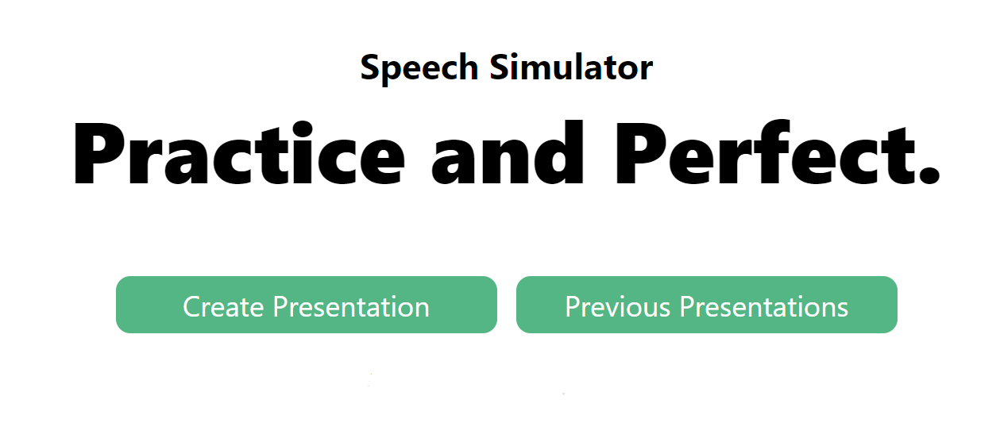
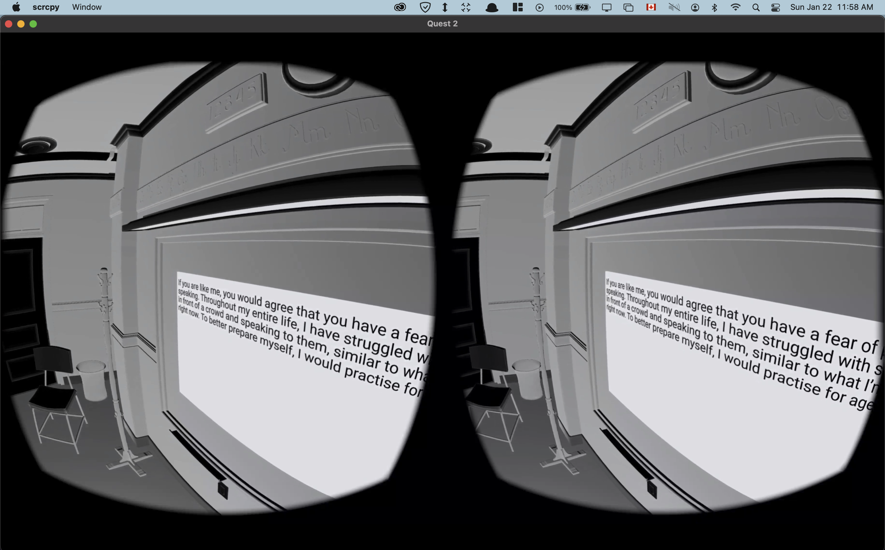

# VR Speech Simulator

_Authors: Marcus C, Tony F, Kentaro L, Danilo V_

## About

VR Speech Simulator is a public speaking simulator that utilizes modern web technologies to construct an immersive virtual reality experience. Are you looking for new ways to practice your public speaking? Try the VR Speech Simulator!

Import a script to create a Presentation. And put on a headset to get started. Each attempt you make through VR Speech Sim keeps track of your speaking patterns and ways to improve your presentation.

## Prerequisites & Technologies

- [Next.js](https://nextjs.org)
- [NextAuth.js](https://next-auth.js.org)
- [Prisma](https://prisma.io)
- [Tailwind CSS](https://tailwindcss.com)
- [tRPC](https://trpc.io/)
- [React](https://reactjs.org/)
- [React Three Fiber](https://github.com/pmndrs/react-three-fiber)
- [React Three XR](https://github.com/pmndrs/react-xr)

## Getting Started

- clone the repo
- npm install
- follow the instructions in the example env file
- npm run dev

##

## Gallery

##

###

## VR Scene

- Blender Classroom Scene
